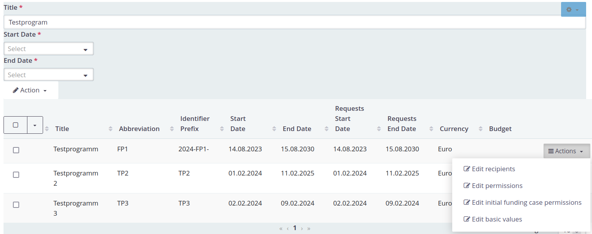

# Administer Funding Programs

This section describes necessary administrative tasks besides the initial [installation](../administration/installation.md) and [necessary adjustments](../administration/necessary-adjustments.md).

## Funding Programs

A funding program contains basic data such as title, funding period, application period, budget etc. It is possible to add user-defined properties. By defining a [funding case type](../administration/necessary-adjustments.md) you can influence the funding logic as described [here](../usage/application-states.md) as well as the forms that are visible to applicants in the funding portal.

### Create a New Funding Program

Navigate to **Funding > Add Funding Program**. Afterward you can enter the following basic values of the program:

* **Title**: The title of the funding program. It is possible to add a long title here.
* **Abbreviation**: A short abbreviation of the program title.
* **Identifier Prefix**: The identifier of a funding case within this funding program will start with the given prefix.
* **Start Date**: The start date of the drawdown phase.
* **End Date**: The end date of the drawdown phase.
* **Requests Start Date**: The start date of the application phase.
* **Requests End Date**: The end date of the application phase.
* **Currency**: The currency for the budget.
* **Budget**: The amount of money that the giving organisation can distribute across the various funding requests.
* **Funding Case Type**: The funding case type used for applications.

The dates **Requests Start Date** and **Requests End Date** refer to the [application phase](../usage/usage.md#phases-of-a-funding-case). The dates **Start** and **End** refer to the [drawdown phase](../usage/usage.md#phases-of-a-funding-case). In most situations, the application phase ends before the drawdown phase starts, i.e. `Requests Start Date < Requests End Date < Start Date < End Date`.

After creating the funding program, you will be redirected to a page that allows you to take further actions. It is recommended to edit the [possible funding recipients](../administration/user-permissions.md#edit-recipients), the [funding program permissions](../administration/user-permissions.md#edit-permissions), and the
[initial funding case permissions](../administration/user-permissions.md#initial-funding-case-permissions).

### Edit Funding Programs

An overview of funding programs can be found at **Funding > Funding Programs**. It lists all funding programs for which the current CiviCRM user has viewing permissions. All administrative tasks related to a funding program are available as actions.

## Manage Document Templates

You can upload different document templates for every funding case type. All documents need to be word documents with the ending _.docx_. They will be processed by [CiviOffice](https://docs.civicrm.org/civioffice/) and may contain tokens that will be replaced accordingly.

Navigate to **Funding > Funding Case Type**. For every funding case type there exist the actions **Manage templates** for required templates and **Manage external application templates** for additional templates that are available for applicants.

### Required Document Templates

There are two templates that are required for the funding case type to work: The transfer contract and the payment instructions. You can upload the documents at **Manage templates**.

### Additional Document Templates

You can specify additional documents, like for example a confirmation of the accuracy of the data or a list of participants of a workshop.

The first step is to upload the documents at **CiviOffice > Upload documents** as shared documents. Afterward, you can select them at **Manage external application templates** and assign a label that will be visible to the applicants. For each document template in that list, there will appear a new action in the funding portal. The action is available for applicants for every application of the corresponding funding case type. For example, if you uploaded a document  _my-example.docx_ with label _My Example Document_, the new action is named _Create: My Example Document_.
