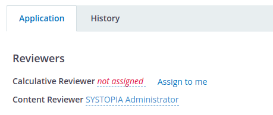
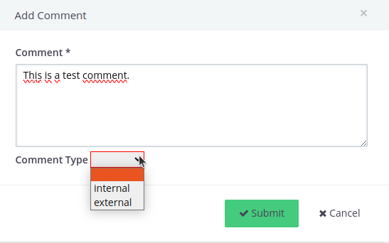
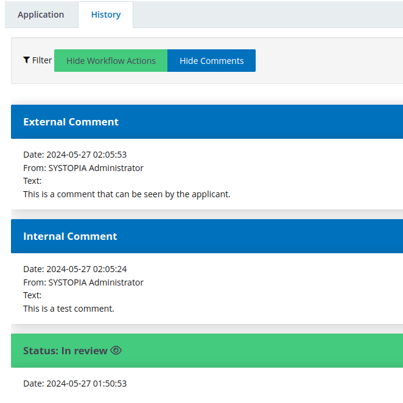

# Usage for Reviewers

This chapter describes the typical usage of the funding framework for people who review the applications and drawdowns.

The actions described below are grouped into the various [phases](./usage.md#phases-of-a-funding-case) that a funding case can go through.

The funding extension creates a new menu entry **Funding** whitin CiviCRM. All actions and links that are relevant for reviewers can be found there.

## Lists

### List of Funding Cases

A list of all [funding cases](../naming-conventions.md#funding-cases) can be found at **Funding > Funding Cases**. The list can be filtered and offers a basic overview.

Opening a case leads to an overview of basic information about that case, including a list of applications that belong to it and a button to [approve](./usage-reviewers.md#approve-a-funding-case) the funding case.

### List of Funding Applications

Apart from the list of applications that are related to a specific funding case, it is also possible to get an overview over all applications. This can be found at **Funding > Applications**.

Opening a funding application leads to an overview of all information that were submitted by the applicant.

### List of Tasks

A list of tasks that are assigned to the person currently logged into CiviCRM can be found at **Funding > My tasks**.
The list includes tasks to review an application.

## Application Phase

The main task for reviewers during the application phase is to review applications and approve or reject funding cases.

The funding extension provides two different types of reviews: A content review and a calculative review. They can be performed by the same or different persons. An application can be approved and get the status *eligible* when both the content review and calculative review are passed.

### Review an Application

Open a funding application. On the left side, it is possible to assign a person to do the calculative or content review:

{ width=350 }

Only contacts with the appropriate permissions can be selected as reviewers.

For contacts with the correct permission and if the application is in an appropriate [state](./application-states.md), there appears a button on the right side of the page to start the review:

{ width=300 }

As soon as a review is started, different actions become available. The list of available actions depends on the [state](./application-states.md) that the application currently has.

{ width=300 }

By starting a review, an activity of type *Internal Funding Application Task* is created and assigned to the contact of the reviewer. The activity has the status *pending* until the review is finished. All activities of this type and status *pending* are listed at **Funding > My tasks**.

### Comments

It is possible to add comments to an application. Comments can be internal or external.

{ width=400 }

Internal comments are only visible in the history tab of the application within CiviCRM. External comments are visible in the history tab in CiviCRM as well as in the history view of the funding portal. Applicants can only see external comments. Both types of comments are stored as activity.

### History of an Application

The history of a funding application contains all status changes of this application as well as internal and external comments.

{ width=400 }

### Approve a Funding Case

When a funding case gets approved, a transfer contract is created and the drawdown phase begins. As long as there is no transfer contract, no drawdowns are possible.

A funding case can be approved in the funding case view which, can be accessed via **Funding > Funding Cases**. It is only possible to approve funding cases with the following properties:

* At least one associated application has the status *eligible*.
* All associated applications have the status *eligible*, *withdrawn*, or *rejected*, i.e. there's a decision about the eligibility.

## Drawdown Phase

...

## Clearing Process

...
